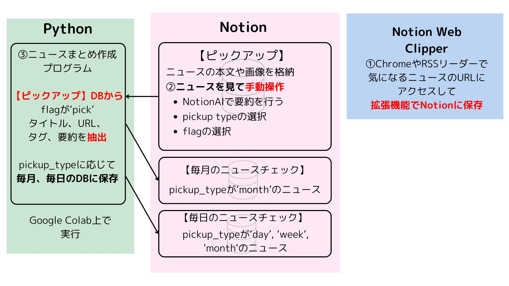

# ニュースピックアップツール

Notionデータベースからニュースを取得し、Claude APIで処理してnoteブログ用に整形するツールです。
Google Colabでの実行を想定しています。



## 前提

- Chrome拡張機能「Notion Web Clipper」を使って、ニュース記事をNotionデータベースに保存していること
- 保存されたニュースに対して、以下のプロパティを入力してあること
    - flag：このプログラムで抽出したいニュースに'pick'を選択
    - summary：このプログラムの要約（Notion AIを使うと簡単）
    - tag：ニュースの分類
    - pickup_type：day/week/monthのどれかを選択。ニュースの重要度を表す。（month > week > day）
        - コードでpickup_type = dayとした場合、flagが'pick'で、pickup_typeが'day', 'week', 'month'のニュースがピックアップされる
        - コードでpickup_type = weekとした場合、flagが'pick'で、pickup_typeが'week', 'month'のニュースがピックアップされる
        - コードでpickup_type = monthとした場合、flagが'pick'で、pickup_typeが'month'のニュースがピックアップされる

## 機能

- Notionデータベースからフラグ付きニュース記事を取得
- Claude APIによる以下の生成：
  - 記事要約
  - ブログタイトル
  - ブログの感想
- note用のフォーマット
- Markdown形式での出力

## Notionデータベースの作成

- 必須プロパティ
    - flag: ステータス（pick or don't pick）
    - name: 記事タイトル
    - summary: 記事の要約
    - tag: 記事のカテゴリタグ
    - pickup_type: ピックアップの種類（day/week/month）

## 使用方法

- flagでピックアップ対象を管理
- pickup_typeで記事の重要度/掲載期間を分類
- tagで記事のジャンルを整理
- summaryに要約を保存（Notion AIの活用を推奨）


## セットアップ

1. Google Colabでノートブックを開く
2. 以下のシークレットをColabに追加：
   - `CLAUDE_API_KEY`: Anthropic Claude APIキー
   - `NOTION_API_KEY`: Notion APIキー
   - `PICKUP_DATABASE_KEY`: ニュースピックアップ用データベースID
   - `DAILY_DATABASE_KEY`: デイリーニュース用データベースID
   - `WEEKLY_DATABASE_KEY`: ウィークリーニュース用データベースID
   - `MONTHLY_DATABASE_KEY`: マンスリーニュース用データベースID

### Colabでのシークレット追加方法

```python
from google.colab import userdata

# シークレットの追加
userdata.set('CLAUDE_API_KEY', 'あなたのAPIキー')
userdata.set('NOTION_API_KEY', 'あなたのAPIキー')
userdata.set('PICKUP_DATABASE_KEY', 'あなたのデータベースID')
# 他のデータベースキーも同様に追加
```

## 使用方法

```python
# パラメータ設定
pickup_type = "day"  # 選択肢: "day", "week", "month"
title_date = "YYYY-MM-DD"
title_name = ""  # オプションの接尾辞

# 処理実行
news_contents = main(pickup_type, title_date, title_name)
news_summary, news_title, news_impression = process_all_news(news_contents)
formatted_result = format_news_articles_for_note(news_summary)

# 結果表示
display_news_markdown(
    news_title=news_title,
    news_impression=news_impression,
    formatted_result=formatted_result
)
```

## セキュリティに関する注意

- APIキーやデータベースIDはバージョン管理にコミットしない
- 機密情報はColabのuserdataを使用して保存
- APIキーは定期的にローテーションし、漏洩に注意